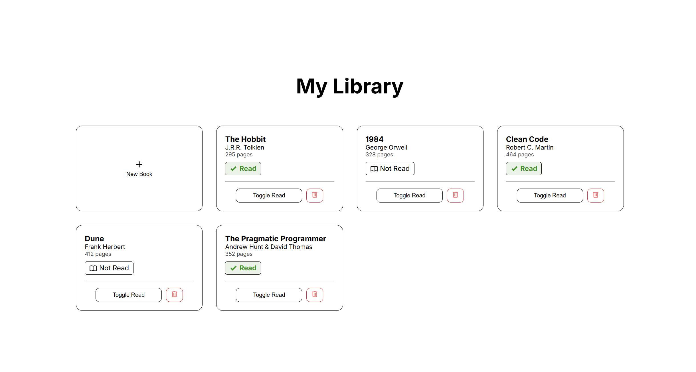

# Library

A small web app for keeping track of the books you own and whether you've read them. Books are added through a modal form, displayed as cards, and can be toggled between read/unread or removed — with the entire UI rendered dynamically from a single array of book objects.

**Live demo:** <https://dani-sink.github.io/project-library/>



## What it demonstrates

- **Object constructors** — each book is modeled with a `Book` constructor (`title`, `author`, `pages`, `read`).
- **State in a single source of truth** — all books live in one array; the UI is always rebuilt from it, never edited piecemeal.
- **Dynamic rendering** — a single render function loops the array and generates the cards, so the DOM always reflects the data.
- **DOM manipulation & event handling** — adding, toggling read status, and removing books.
- **Linking DOM to data** — each card carries a `data-id` so click handlers know exactly which book to act on.
- **Modal form** — a show/hide dialog with a dimmed backdrop for entering new books.
- **Responsive CSS Grid** — an `auto-fit` / `minmax()` layout that reflows from multiple columns down to one, with no media queries.

## Features

- Add a book via a modal form (title, author, page count, and a read/unread checkbox)
- Each book shown as a card with its details and a colored read-status badge
- Toggle any book between **Read** and **Not Read**
- Remove any book from the library
- Responsive grid that adapts to the screen width

## Built with

- HTML5
- CSS3 (Flexbox & Grid)
- Vanilla JavaScript (ES6) — object constructors, no frameworks or libraries

## Running locally

```bash
git clone https://github.com/<your-username>/<your-repo>.git
cd <your-repo>
```

Then open `index.html` in your browser — there's no build step.

## What I learned

- The trickiest part was connecting each rendered card back to its book in the data array. I solved it by tagging every card with a `data-id` matching the book's position/identifier, so the remove and toggle handlers can find and update the right object.
- Keeping the array as the single source of truth — and re-rendering after every change rather than editing the DOM directly — made the app far easier to reason about and debug.

## Possible improvements

- Edit an existing book
- Sort or filter books (by read status, title, or length)
- Reading progress (current page vs. total)
- Books persist across page reloads using localStorage

---

_Built as part of The Odin Project's Full Stack JavaScript path._
